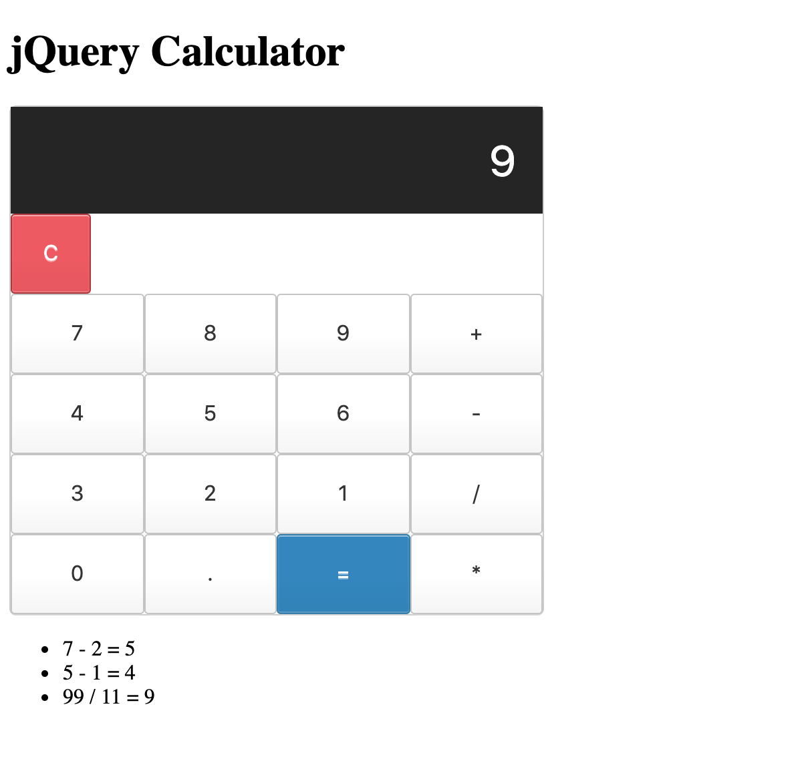

# jQuery Calculator

## Description
Duration: Weekend Project 

This jQuery Caluclator allows users to complete basic arithmetic operations and records the results of past calculations. 

## Screen Shot

### Prerequisites
- [Node.js](https://nodejs.org/en/)

## Installation 

Install this project by forking and cloning this github repository to local file system. Use npm install to bring in dependencies. 

## Usage
1. User is presented with a calculator interface where they may complete basic arithmetic either by typing or clicking buttons 
    -This calculator currently only allows arithmetic with positive numbers
2. Using the clear ('C') button will clear the values currently entered on the calculator screen
3. When the user clicks equals the result of the calculation displays in the calculator screen 
    - Additionally the calculation will be added to the listing of historic calculations below the calculator 

## Built With

- javascript 
- jQuery
- Node using express, body-parser, and decimal.js

## Roadmap
- Allow user to enter multiple operations at once currently restricted to single calculation
- The validation to make sure users only uses one operation prevents users from using negative numbers in calculations 
- Add validation to calculator screen so that users cannot enter invalid characters

## Acknowledgement
Thanks to Prime Digital Academy. 
