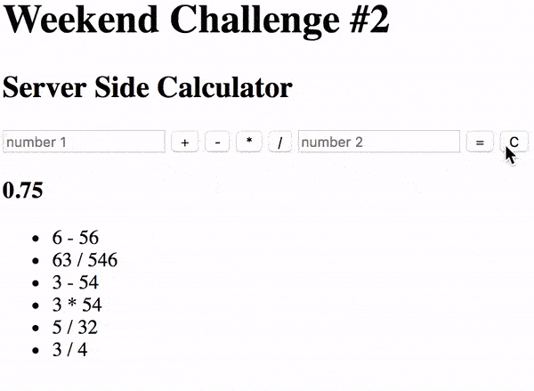

Welcome to the second weekend challenge!

You are going to be building a server-side calculator!

The logic for the calculator **must** be implemented on the server. On the DOM, the user will input two values (2 input elements) and the select type of mathematical operation. The client side logic will capture this input, bundle it up in an object, and then send this object to the server via a POST.

Create the user interface and appropriate event handlers that will take the user input and sends the information to the Server via a POST.

Build out the server-side logic to compute the numbers as appropriate. The server should be able to handle Addition, Subtraction, Multiplication, and Division. Once the calculation is complete, send it back to the client in an object where it should be displayed on the DOM.

> NOTE: You can send an object back as a response to a POST request or follow up the POST with a GET request to retrieve the data. Using a GET request to follow up is more common at Prime and will put you in a better position working on the History feature below.

## History:
Keep a historical record of all math operations on the server. Display a list of all previous calculations on the page when it loads. Update the list when a new calculation is made.

---

---
## Stretch Goals:

- Build a 'clear' button that resets the whole experience.

- Convert the interface to look and behave like a calculator as shown below.

*Interfaces that mirror real world objects are often more intuitive and self-explanatory for users.*

---

---

- Only allow the POST call to happen if all necessary input is ready.

*Data integrity is superfluously important! Sometimes users hit tje "go button" without fully inputting the needed fields. Show an alert if they left something empty and don't send bad or incomplete data to the server.*

- Allow a user to clear the history by clicking on a button. Technically this shouldn't be a GET or a POST. Look into making a DELETE request!

*GETs are used to, well, get information from the server. POSTs are used to send new info to the server. DELETEs are used for, you guessed it, deleting info already on the server.*

- Allow a user to click on an entry in the History list to re-run that calculation. This should display the answer on the calculator interface like a normal calculation.

*Anticipating a user's wants and adding the feature in the interface is often a logical progression that ends up in stretch goals for project.*

- Deploy to Heroku!

*Deploying a project makes it available to the masses and is a necessary step for which to prepare when planning a project.*
